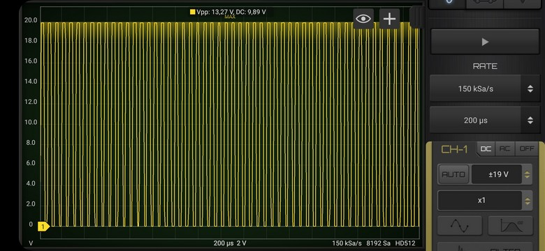
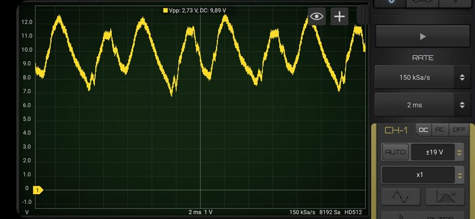

# PWM WAV player demo
## project name: mbed6_PWM_wavplayer
Tested by: **Keil Studio** 1.5.55 and **Mbed-OS** 6.16.0

This project demonstrates simple filesystem handling on an SD card
and the hobbi8.wav audio file read from the SD card and played by using  
PWM audio output. For compatibility reason the FatFileySystem 
library is used (the LittleFileSystem and LittleFileSystem2 type filesystems
do not provide compatibility with oher operating systems like Windows, Linux or Mac OS). 

The program tries to mount the filesystem and to open a wav file (hobbi8.wav).
If it is a valid wav file having 8 bit audio samples then it will be played
through a PWM channel (we use pin PB_0 as output, i.e. the pin labeled A3 on the board).

We assume, that the wav file is a mono file, containing 8-bit unsifned 
auidio samples at sampling rate of 8 kHz. Of course, the program can be 
extended to accept different formats...

Besides the library modules available in Mbed API we have to 
import the AudioPlayer library as well (this library is containing
the WaveAudioStream object class what we actually need).


### References: 
* [mbed6_SD_filesystem](https://github.com/cspista/mbed6_SD_filesystem)
* [mbed6_PWM_sinewave](https://github.com/cspista/mbed6_PWM_sinewave)
* [mbed-os-audioplayer](https://github.com/ARMmbed/mbed-os-audioplayer) (ARM Mbed official library)
* [USB WAV audio player tutorial](https://os.mbed.com/docs/mbed-os/v6.15/apis/usb-wav-audio-player.html) (Mbed official example)

## Hardware requirements
* NUCLEO-F446RE development board
* SD card breakout (we used an 1.8" TFT board wich has an SD card socket on the back side)
* USB connection to a PC through the built-in ST-Link v2-1

## Wiring instructions for the NUCLEO-F446RE board

We selected the SPI3 channel for driving the SD card. 

| SD card | color | signal |pin   |
|:-------:|:----: |:-----:|:-------:|
|  DO    | blue   | MISO  | PC11    |
|  SCLK  | yellow | SCLK  | PC10    |
|  DI    | green  | MOSI  | PC12    |
|  CS    | brown  | CS    | PD2     |
|  VCC   | red    | VCC   | 5V/3.3V |
|  GND   | black  | GND   | GND     |


## Software requirements
* Start with an empty mbed 6 project
* Import the AudioPlayer libraray (URL: https://github.com/ARMmbed/mbed-os-audioplayer )
* Edit the main.cpp source file
* Configure the project by adding an **mbed_app.json** file in which
    * We have to add the **SD** component and the **STORAGE** features_add
    * We have to override the pin connections according to the selected **SPI** channel

Finally the **mbed_app.json** sholuld look like this: 

```
{
    "target_overrides": {
        "*": {
            "target.features_add": ["STORAGE"],
            "target.components_add": ["SD"],            
            "sd.SPI_MOSI" : "PC_12",
            "sd.SPI_MISO" : "PC_11",
            "sd.SPI_CLK"  : "PC_10",
            "sd.SPI_CS"   : "PD_2"
        }
    }
}
```
## mbed6_PWM_wavplayer results
In the first figure the raw output obtained from pin PB_0 is shown.
One can see here only wider or narrower PWM pulses.



When a simple RC low pass filter was applied (R = 1k, C = 470nF) the output 
signal became quite nice, but one can expect here about 30-40 % loss in the 
peak-to-peak amplitude as it was demonstrated in the case of the 
[mbed6_PWM_sinewave](https://github.com/cspista/mbed6_PWM_sinewave) project.



